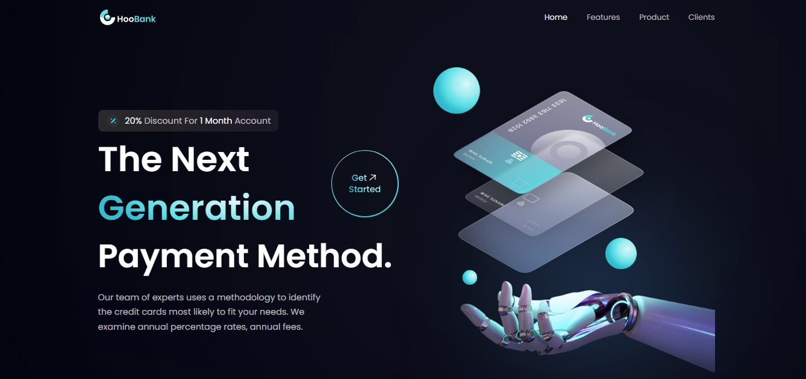
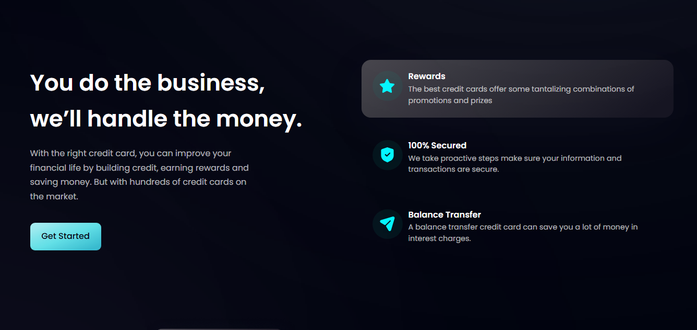
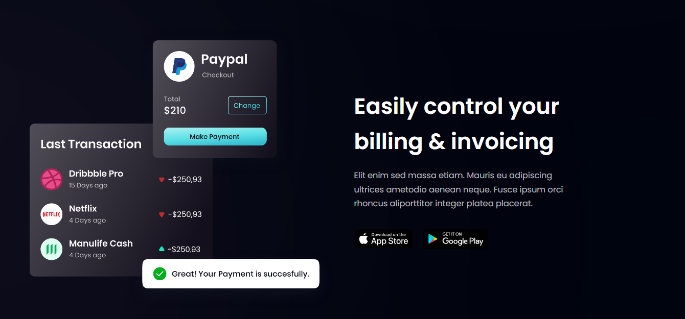

<div id="top"></div>

[](https://react.dev/)


<!-- PROJECT LOGO -->
<br />
<div align="center">
  <a href="https://hoo-bank-sooty-beta.vercel.app/">
    
  </a>
  <h1 align="center">HooBank </h1>

  <p align="center">
    <a href="https://hoo-bank-sooty-beta.vercel.app/">View Demo</a>
    ·
    <a href="https://github.com/SalahShallapy/HooBank/issues">Report Bug</a>
  </p>
</div>

HooBank is a modern banking web application designed with a sleek, responsive UI built using React and Tailwind CSS. It provides a futuristic and engaging banking experience with optimized performance and seamless navigation.

## Project overview

### Home page overview



### Features overview



### Services overview



## Features

- **Modern UI/UX**: A clean and professional design for an enhanced user experience.

- **Dynamic Landing Page**: Interactive and visually appealing homepage for users.

- **Smooth Navigation**: Intuitive and fluid transitions between sections.

- **Optimized Performance**: Fast loading times with optimized assets and components.

- **Reusable Components**: Modular and reusable code structure for easy expansion.

- **Responsive**; Ensures seamless functionality and aesthetics across all devices.

## Project Structure

```
HooBank
│      .gitignore
│      index.html
│      package-lock.json
│      package.json
│      postcss.config.js
│      README.md
│      tailwind.config.js
│      vite.config.js
│
├───public
│       hoobanke.svg
│
├───src
│    │  App.jsx
│    │  index.css
│    │  main.jsx
│    │  index.js
│    │
│    └───components
│    │      Billing.jsx
│    │      Business.jsx
│    │      Button.jsx
│    │      CardDeal.jsx
│    │      Clients.jsx
│    │      CTA.jsx
│    │      FeedbackCard.jsx
│    │      Footer.jsx
│    │      GetStarted.jsx
│    │      Hero.jsx
│    │      index.js
│    │      Navbar.jsx
│    │      Stats.jsx
│    │      Testimonials.jsx
│    │
│    └───constants
│    │        index.js
│    │
│    └───assets ------> All images sources
│    │
```

## Installation

To get started with the project locally:

1. Clone the repository:
   ```bash
   git clone https://github.com/SalahShallapy/HooBank.git
   ```
2. Navigate to the project directory:
   ```bash
   cd HooBank
   ```
3. Install dependencies:
   ```bash
   npm install
   ```
4. Run the project:
   ```bash
   npm run dev
   ```

## Contributing

Contributions are what make the open source community such an amazing place to learn, inspire, and create. Any contributions you make are **greatly appreciated**.

If you have a suggestion that would make this better, please fork the repo and create a pull request. You can also simply open an issue with the tag "enhancement".
Don't forget to give the project a star! Thanks!

1. Fork the Project
2. Create your Feature Branch (`git checkout -b feature/AmazingFeature`)
3. Commit your Changes (`git commit -m 'Add some AmazingFeature'`)
4. Push to the Branch (`git push origin feature/AmazingFeature`)
5. Open a Pull Request
